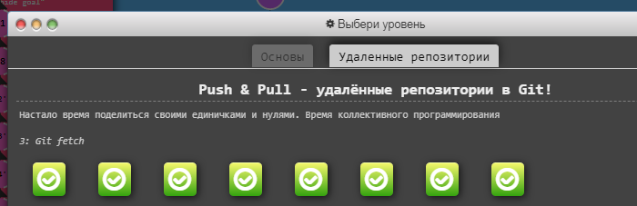

# kottans-frontend

# git-intro

### Я вже проходив курс Git HOW, та корисно було відновити у памяті багато моментів.

---
## Linux CLI, and HTTP

---
## Git Collaboration

---
## Intro to HTML and CSS

---
