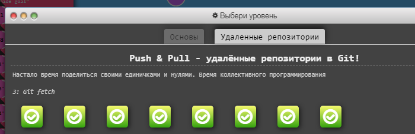
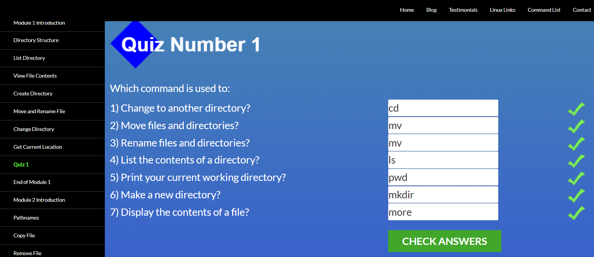
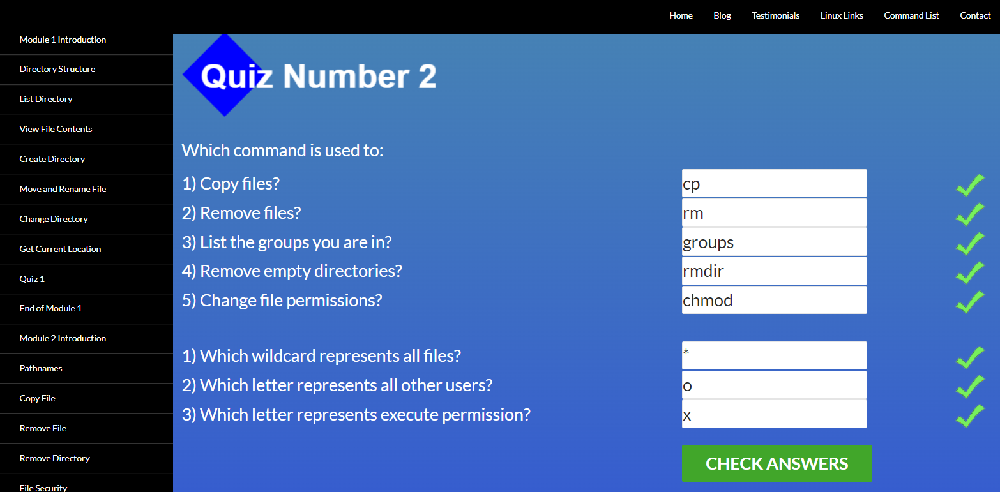
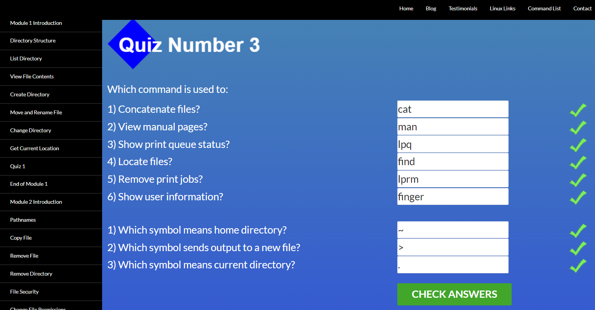
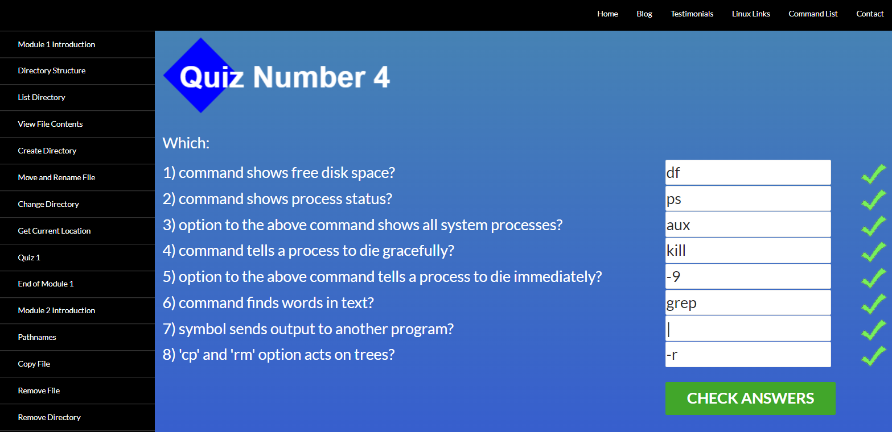
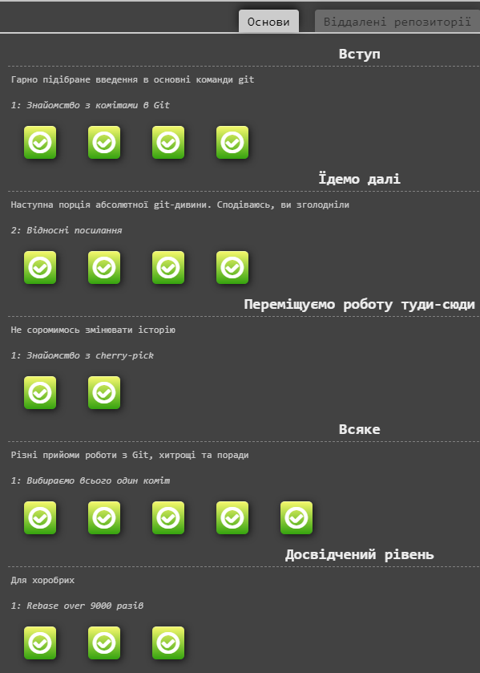
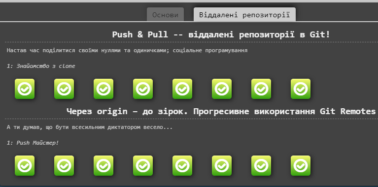
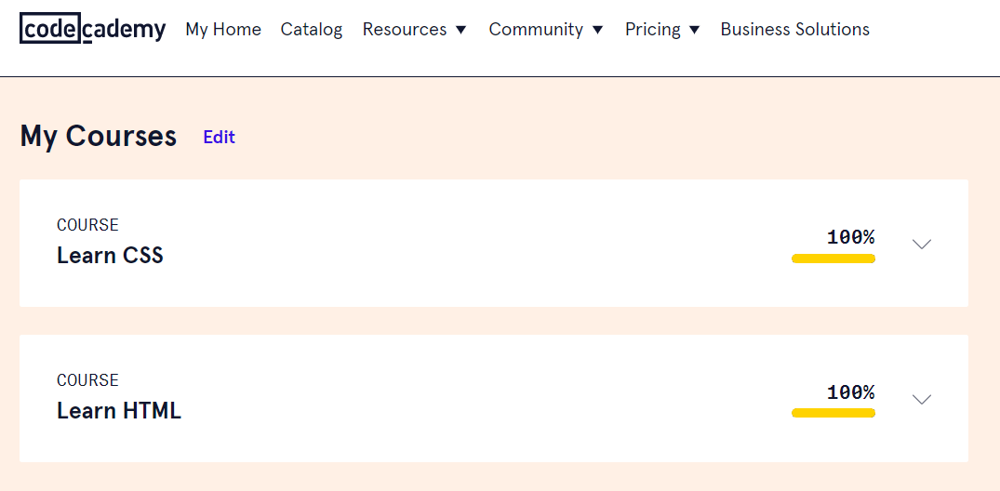
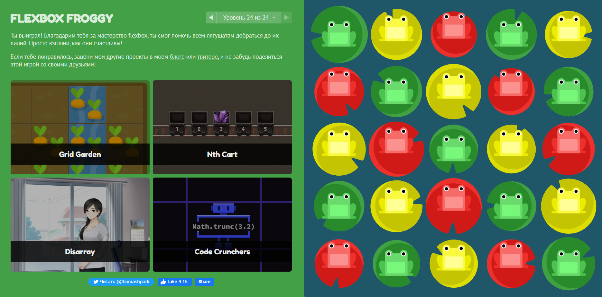

# kottans-frontend

# git-intro

1. Я вже проходив курс Git та використовував його на практиці, корисно було відновити у памяті багато моментів. 
2. В цьому розділі нічого не здивувало. 
3. Гадаю я все буду використовувати!

---
## Linux CLI, and HTTP

1. Хоча мені й доводілосья працювати з Linux, та було новим все з розділу безпеки 
2. Не можу відповісти
3. Якщо в мене буде необхідність використовувати Linux, то командами з 1 та 2 модулю я буду користуватися часто. 

---
## Git Collaboration
1. Майже все з цих розділів було для мене новим (читав, та майже нічого не використовував на практиці)
2.
3. Ще не знаю, але гадаю що так 

---
## Intro to HTML and CSS
1. В цьому розділі все було для мене знайоме, я вже займався вивченням HTML/CSS
2.
3. Більшість з вивченного я буду вікористовуваті в майбутньому.

---
 
## Responsive Web Designe

1. Дуже сподобався цей розділ. flexbox - для мене нова технологія, та дуже цікава. З Grid вже був знайомий, та багато чого вже забув.
2. Наскільки швидко та просто можливо верстати з Flex
3. Однозначно буду використовувати flexbox! Зараз пробую зверстати декілька шаблонів 

---

## HTML і CSS практика: Hooli-style Popup

[Demo](https://acerpo.github.io/HTML-CSS-Popup/)

1. Много времени ушло, чтобы разобраться почему не работает то, что я делал по примерам в которых все работало 😅. Мне понравилось задание, а в особенности результат )
2. Удивило количество вариантов как можно было выполнить это задание, но то что правильный только один из них.
3. Точно буду использовать навыки которые получил в ходе этой практики в работе. Или хотя бы в ближайших проектах.
